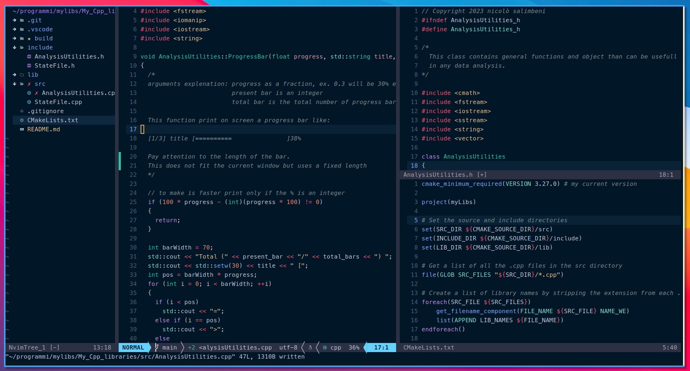

# 🌟 My NeoVim Configuration 🌟

Welcome to my NeoVim setup! Here, you'll find the configuration files and plugins that make up my customized NeoVim environment. Feel free to explore, and if you find anything interesting, consider adapting it for your own use.

## Table of Contents
- [Introduction](#introduction)
- [Configuration Highlights](#configuration-highlights)
- [Installation](#installation)
- [Plugins](#plugins)
- [Feedback](#feedback)

## Introduction

NeoVim is a powerful text editor that I've customized to suit my workflow and preferences. This repository contains the configuration files and settings that make up my personalized NeoVim setup. My setup is based on the basic structure proposed in this [video](https://www.youtube.com/watch?v=vdn_pKJUda8). Starting from this I then adapted the various plugins to my use case (experimental physics student: c++, pyhton, latex, markdown).

## Preview



## Configuration Highlights

- **Speed:** Speed of navigation between files and documents
- **Key Mappings:** Customized key mappings to enhance productivity.

Explore the [lua](lua/) directory for a detailed look at my NeoVim settings.

## Dependencies

Make sure you have the following dependencies installed to use this NeoVim configuration:

1. **[NeoVim](https://github.com/neovim/neovim)**: (v0.9.4 recommended);
2. **[Nerd Fonts](https://github.com/ryanoasis/nerd-fonts) for Icons**;

3. **True-Color Terminal**: requested by the color theme, I'm using alacritty, but any true color terminal should be fine; 

## Installation

1. Clone this repository to your local machine:

    ```bash
    git clone https://github.com/NicoloSalimbeni/nvim-configuration ~/.config/nvim
    ```

2. Enter the downloaded folder, then in the file path nvim/lua/nicolo/ you will find a file called plugins-setup.lua, open it and save it with :w . Inside this file there is a function which every time the file is saved installs all the plugins. Since you just downloaded everything you need to install them for the first time.

3. Enjoy your new NeoVim setup!

## Plugins

Here are some of the key plugins I'm using:

1. [**Packer**](https://github.com/wbthomason/packer.nvim) - A fast, optimized plugin manager for Neovim.
   - *Description: Packer provides a more efficient way to manage and load plugins with improved performance.*

2. [**Plenary**](https://github.com/nvim-lua/plenary.nvim) - Lua utility functions for Neovim plugins.
   - *Description: Plenary offers useful Lua functions to simplify plugin development for Neovim.*

3. [**vim-nightfly-guicolors**](https://github.com/bluz71/vim-nightfly-guicolors) - A dark Vim theme with vibrant colors.
   - *Description: Nightfly is a visually appealing dark theme with vibrant and distinguishable colors.*

4. [**vim-tmux-navigator**](https://github.com/christoomey/vim-tmux-navigator) - Seamless navigation between Vim and Tmux panes.
   - *Description: Tmux Navigator enables smooth navigation between Vim and Tmux panes with key bindings.*

5. [**vim-maximizer**](https://github.com/szw/vim-maximizer) - Maximizes and restores the current window in Vim.
   - *Description: Vim Maximizer allows you to maximize and restore the current window for distraction-free editing.*

6. [**gitsigns**](https://github.com/lewis6991/gitsigns.nvim) - Git signs and decorations for Neovim.
   - *Description: Gitsigns provides Git-related signs and decorations in the Neovim gutter for enhanced version control.*

7. [**vim-surround**](https://github.com/tpope/vim-surround) - Quoting and parenthetical editing in Vim.
   - *Description: Vim Surround simplifies quoting and editing of parentheses, brackets, and quotes in Vim.*

8. [**vim-ReplaceWithRegister**](https://github.com/vim-scripts/ReplaceWithRegister) - Replace text with the contents of a register in Vim.
    - *Description: ReplaceWithRegister allows you to replace text with the contents of a specified register.*

9. [**Comment.nvim**](https://github.com/wbthomason/nvim-comment) - A comment toggler plugin for Neovim.
    - *Description: Comment.nvim provides easy-to-use toggling of comments for various file types.*

10. [**nvim-tree**](https://github.com/kyazdani42/nvim-tree.lua) - File explorer tree for Neovim.
    - *Description: Nvim-tree is a feature-rich file explorer tree for Neovim, enhancing file navigation.*

11. [**nvim-web-devicons**](https://github.com/kyazdani42/nvim-web-devicons) - Icons for file types in Neovim.
    - *Description: Nvim-web-devicons adds visually appealing icons to file types in the Nvim-tree file explorer.*

12. [**lualine**](https://github.com/hoob3rt/lualine.nvim) - A fast and customizable statusline for Neovim.
    - *Description: Lualine provides a fast and highly customizable statusline for a personalized Neovim experience.*

13. [**telescope-fzf-native**](https://github.com/nvim-telescope/telescope-fzf-native.nvim) - FZF integration for Telescope.
    - *Description: Telescope FZF Native integrates FZF into Telescope for faster and efficient fuzzy finding.*

14. [**telescope**](https://github.com/nvim-telescope/telescope.nvim) - A highly extensible fuzzy finder over lists.
    - *Description: Telescope is a powerful fuzzy finder with extensibility for efficient searching and navigation.*

15. [**nvim-treesitter**](https://github.com/nvim-treesitter/nvim-treesitter) - A tree-sitter parser for Neovim.
    - *Description: Nvim-treesitter enhances syntax highlighting and parsing using the tree-sitter parser.*

Feel free to check out the [init.lua](init.lua) file to see how these plugins are configured.


## Feedback

If you have any suggestions, improvements, or questions about my NeoVim configuration, feel free to [open an issue](https://github.com/NicoloSalimbeni/nvim-configuration/issues). I appreciate your feedback!

Happy coding! 🚀

